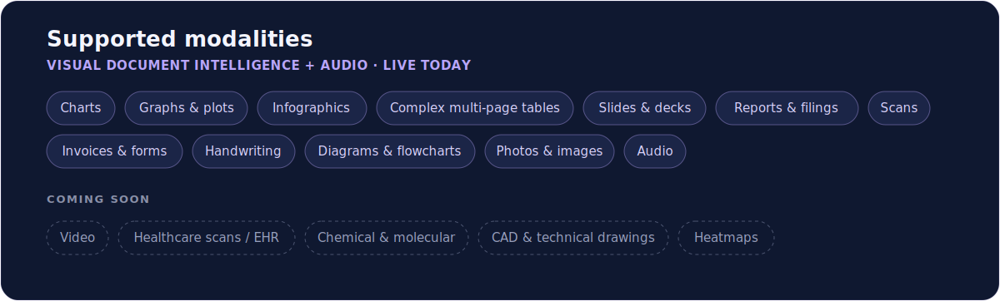

<div align="center">

<a href="https://github.com/polyvia-ai/polyvia">
  
</a>

<br />

### Polyvia: Multimodal Document Agents over 100K+ files

We build enterprise agents for large-scale retrieval, research and automation over multimodal docs.

[](https://github.com/polyvia-ai/polyvia/stargazers/)
[](https://github.com/polyvia-ai/polyvia/commits/)
[](https://github.com/polyvia-ai/polyvia/tags/)

[](https://docs.polyvia.ai)
[](https://pypi.org/project/polyvia)
[](https://www.npmjs.com/package/polyvia)

[Docs](https://docs.polyvia.ai) · [Quickstart](https://docs.polyvia.ai/quickstart) · [Python SDK](https://docs.polyvia.ai/products/python-sdk) · [TypeScript SDK](https://docs.polyvia.ai/products/js-sdk) · [Polyvia Platform](https://app.polyvia.ai) · [Homepage](https://polyvia.ai)

</div>

---

We’re releasing Polyvia 1, as two products:
- **Polyvia API: Multimodal Document Retrieval API** (for developers of AI agents) - <u>available now</u>.
- **Polyvia Platform: Research and Automation Agent over 100K+ multimodal docs** (for knowledge workers in enterprises) - <u>coming soon</u>.

## Why Polyvia

**1. Fast over 100K+ multimodal docs.** Agentic, file-by-file search (Claude Code,
Claude Cowork, Codex) works only up to ~100 multimodal files — past that it's too
slow, and at scale you still need **retrieval**. Polyvia does **sub-200ms** search
over 100K+ files, every answer grounded in a cited source page.

**2. End-to-end — no need for extractors or PDF parsers.** When you build
large-scale multimodal RAG over a company's files, the only infra available today
is visual extractors / PDF parsers (Reducto, LlamaIndex). There's no **end-to-end**
infra for large-scale multimodal document retrieval — until Polyvia: **VLM Visual
Extractor → Multimodal Knowledge Ontology (mapping all your company's data and
processes) → Self-Improving Retrieval Agent**.

**3. All unstructured, visual and multimodal data inputs in one API.** Available now: PDFs, charts, infographics, complex multi-page tables, slides, pictures, handwriting, scans, invoices, audio. Coming soon: video, healthcare scans / EHR, chemical & molecular data, CAD & technical drawings, heatmaps.

<p align="center">
  
</p>

### What people build with it
- **Multimodal RAG inside your own agent** — retrieval-as-a-tool over large doc sets.
- **Data-room / due-diligence search** — query 100+ visual-heavy PDFs jointly (PE, IB, M&A).
- **Counterparty & credit monitoring** — EBITDA, opex, revenue across hundreds of borrower reports.
- **Image-based claim processing** — describe claim photos in the context of a policy.
- **Cross-engagement slide search** — find answers buried in thousands of slides.

## Install

```bash
pip install polyvia        # Python 3.9+
npm  install polyvia       # Node 18+
```

## Quickstart

Grab a key in [Polyvia Platform](https://app.polyvia.ai) → **Settings → API**.
Ingest a batch into a **group**, then ask one question across the whole corpus —
answers cite the exact page in each document.

#### Python SDK
```python
from polyvia import Polyvia

client = Polyvia(api_key="poly_<key>")  # or set POLYVIA_API_KEY

# Ingest a batch into a group, then ask one question across all of it.
items = client.ingest.batch(
    ["q1.pdf", "q2.pdf", "q3.pdf", "q4.pdf"],
    group="FY24 Earnings",
)
for item in items:
    client.ingest.wait(item.task_id)

print(client.query("How did revenue trend across the four quarters?",
                   group="FY24 Earnings").answer)
```

#### JavaScript/TypeScript SDK
```ts
import { Polyvia } from "polyvia";

const client = new Polyvia({ apiKey: "poly_<key>" });

const items = await client.ingest.batch(
  ["q1.pdf", "q2.pdf", "q3.pdf", "q4.pdf"],
  { group: "FY24 Earnings" },
);
await Promise.all(items.map((i) => client.ingest.wait(i.task_id)));

const answer = await client.query(
  "How did revenue trend across the four quarters?",
  { group: "FY24 Earnings" },
);
console.log(answer.answer);
```

Scope a query three ways: a single `document_id` (fastest), a `group` /
`group_ids`, or the whole workspace (no scope).

### More examples

Runnable scripts live in [`examples/`](./examples). A few highlights:

| Example | What it shows |
| --- | --- |
| [`query_scopes.py`](./examples/query_scopes.py) | All four query scopes — workspace, document, group, many groups |
| [`groups_and_documents.py`](./examples/groups_and_documents.py) | Create/find/list groups; list, get, move and delete documents |
| [`batch_group.py`](./examples/batch_group.py) | Ingest a batch into a group, then query across it |
| [`async_client.py`](./examples/async_client.py) | `AsyncPolyvia` — the same surface, awaitable |
| [`agent_tool.py`](./examples/agent_tool.py) | Expose Polyvia retrieval as a tool to your own agent |
| [`curl.sh`](./examples/curl.sh) | The same loop over raw HTTP, no SDK |

Querying across scopes, for example:

```python
# whole workspace · a group (by name) · one document (fastest) · many groups (by id)
client.query("What risks recur across all reports?")
client.query("How did revenue trend?", group="FY24 Earnings")
client.query("Executive summary?", document_id="doc_<id>")
client.query("Compare the deals.", group_ids=["g_<id>", "g_<id>"])
```

→ [Full Developer Docs](https://docs.polyvia.ai/) 

## Use it from an agent

**MCP** — connect Claude Code (or any MCP client) to the hosted Polyvia MCP server
in one line, so your agent can retrieve over your documents as a tool:

```bash
claude mcp add --transport http polyvia https://app.polyvia.ai/mcp \
  --header "Authorization: Bearer poly_<your-key>"
```

**Agent Skills** — install Polyvia skills into Claude Code, Cursor, and other agent
clients:

```bash
npx skills add polyvia-ai/skills
```

→ [MCP docs](https://docs.polyvia.ai/products/mcp) · [Agent Skills](https://docs.polyvia.ai/products/skills)

## Roadmap

| | Product | For | Status |
| --- | --- | --- | --- |
| **Polyvia-1.1** | **Polyvia API** — Multimodal Document Retrieval API | Developers of AI agents | **Available now** |
| **Polyvia-1.2** | **Polyvia Platform** — Research & Automation Agent over 100K+ multimodal docs | Knowledge workers in enterprises | **Coming soon** |
| **Later** | **Polyvia Agents** — build your own agent for automating processes on large volumes of multimodal docs | Builders & Teams | **Planned** |
| **Later** | **More modalities** — video, healthcare scans / EHR, chemical & molecular data, CAD & technical drawings, heatmaps | Builders & teams | **Planned** |


## Release log

We update this as we ship — latest first. Full notes at [docs.polyvia.ai/versions](https://docs.polyvia.ai/versions).

### Polyvia-1.1 — Polyvia API · _available now_

- **REST API v1** — `ingest`, `documents`, `groups`, `query`, `usage`, `rate-limits`; async ingestion with task polling and grounded citations.
- **Python SDK** — `pip install polyvia`; typed sync **and** async clients, batch ingestion, idempotent groups, structured errors.
- **TypeScript SDK** — `npm install polyvia`; fully typed, ESM/CJS, Node 18+.
- **MCP server** — `claude mcp add --transport http polyvia https://app.polyvia.ai/mcp --header "Authorization: Bearer poly_<your-key>"`.
- **Agent Skills** — `npx skills add polyvia-ai/skills` for Claude Code, Cursor, and other agent clients.
- **Visual Document Modalities** — Visual Document Intelligence + Audio: charts, graphs & plots, infographics, complex multi-page tables, slides & decks, reports & filings, scanned & photographed pages, invoices & forms, handwriting & annotations, diagrams & flowcharts, photos & images, and audio (calls, meetings, recordings).

### Up next

- **Polyvia-1.2 — Polyvia Platform** — Research & Automation Agent over 100K+ multimodal docs, for knowledge workers in enterprises.
- **More modalities (coming soon)** — healthcare scans / EHR, chemical & molecular data, CAD & technical drawings, video, heatmaps.
- **Polyvia Agents** — build your own agent for automating processes on large volumes of multimodal documents.

## SDKs & reference

| | Install | Source |
| --- | --- | --- |
| Python | `pip install polyvia` | [polyvia-sdk-python](https://github.com/polyvia-ai/polyvia-sdk-python) |
| TypeScript | `npm install polyvia` | [polyvia-sdk-typescript](https://github.com/polyvia-ai/polyvia-sdk-typescript) |
| REST API | — | [docs.polyvia.ai/api-reference](https://docs.polyvia.ai/api-reference/introduction) |
| MCP | hosted · `app.polyvia.ai/mcp` | [docs.polyvia.ai/products/mcp](https://docs.polyvia.ai/products/mcp) |
| Agent Skills | `npx skills add polyvia-ai/skills` | [docs.polyvia.ai/products/skills](https://docs.polyvia.ai/products/skills) |

Supported inputs: PDFs · Word/PowerPoint/Excel (DOCX/PPTX/XLSX) · Markdown · text
· images · audio. Charts, infographics, complex multi-page tables, slides, scans
and handwriting are first-class.

## Resources

Runnable snippets (Python, TypeScript, raw HTTP, MCP, agent-tool) live in
[`examples/`](./examples) — see the [examples guide](./examples/README.md). See also
[`CHANGELOG`](./CHANGELOG.md) · [`CONTRIBUTING`](./CONTRIBUTING.md) · [`SECURITY`](./SECURITY.md).

New to Polyvia? See what it does at **[polyvia.ai](https://polyvia.ai)**, or start
free at **[app.polyvia.ai](https://app.polyvia.ai/sign-up)**.

📚 [Docs](https://docs.polyvia.ai) · 🖥️ [Platform](https://app.polyvia.ai) · ✉️ mateusz@polyvia.ai · senyao@polyvia.ai

## License

© 2026 Polyvia. All rights reserved.
